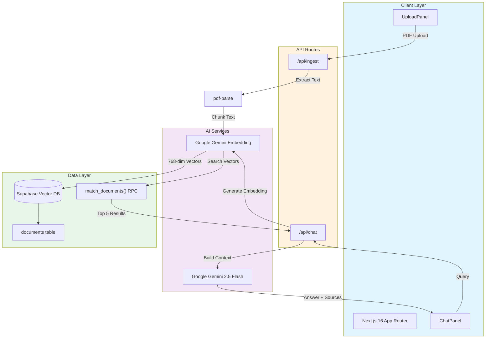

# DocSense

A RAG (Retrieval-Augmented Generation) powered document intelligence platform built with Next.js 16. Chat with your PDFs using AI-powered semantic search.

[](https://www.loom.com/share/99899970fec343fe925124427a1ca928)
[](https://docsense-swart.vercel.app/)

---

## Overview

DocSense enables you to upload PDF documents, automatically processes them into semantic embeddings, and provides an intelligent chat interface to ask questions about your documents. The system uses Google's Gemini AI for embeddings and generation, with Supabase as the vector database for fast semantic search.

### Features

- **PDF Upload & Processing** - Drag-and-drop PDF ingestion with automatic text extraction
- **Semantic Search** - Find relevant information using natural language queries
- **AI Chat Interface** - Ask questions and get answers based on your document content
- **Source Attribution** - See which documents and pages the answers come from
- **Real-time Processing** - Watch as documents are processed chunk by chunk
- **Responsive Design** - Clean, modern UI built with Tailwind CSS 4

---

## Architecture



### Data Flow

1. **Ingestion Flow**
   - User uploads PDF via UploadPanel
   - `/api/ingest` extracts text using `pdf-parse`
   - Text is split into 500-word chunks with 50-word overlap
   - Gemini Embedding API generates 768-dimensional vectors
   - Chunks + embeddings stored in Supabase `documents` table

2. **Chat Flow (RAG Pipeline)**
   - User sends message in ChatPanel
   - `/api/chat` embeds the query using Gemini
   - Supabase `match_documents()` performs vector similarity search
   - Top 5 relevant chunks retrieved as context
   - Gemini 2.5 Flash generates answer with source citations
   - Response returned with unique source attributions


## Tech Stack

| Category | Technology |
|----------|------------|
| Framework | Next.js 16.2.2 (App Router) |
| UI Library | React 19.2.4 |
| Styling | Tailwind CSS 4 |
| Icons | Lucide React |
| AI/ML | Google GenAI SDK (@google/genai) |
| Embeddings | Gemini Embedding 001 (768-dim) |
| LLM | Gemini 2.5 Flash |
| Database | Supabase (PostgreSQL + pgvector) |
| PDF Parsing | pdf-parse |
| Language | TypeScript 5 |

---

## Getting Started

### Prerequisites

- Node.js 20+
- Google Generative AI API key
- Supabase project with vector extension enabled

### Environment Setup

Create a `.env.local` file in the root:

```env
# Google AI
GEMINI_API_KEY=your_gemini_api_key_here

# Supabase
NEXT_PUBLIC_SUPABASE_URL=https://your-project.supabase.co
NEXT_PUBLIC_SUPABASE_PUBLISHABLE_DEFAULT_KEY=your_publishable_key_here
SUPABASE_SERVICE_KEY=your_service_role_key_here
```

### Supabase Database Setup

Enable the vector extension and create the documents table:

```sql
-- Enable pgvector extension
CREATE EXTENSION IF NOT EXISTS vector;

-- Create documents table
CREATE TABLE documents (
    id BIGSERIAL PRIMARY KEY,
    content TEXT NOT NULL,
    embedding VECTOR(768),
    metadata JSONB DEFAULT '{}',
    created_at TIMESTAMP WITH TIME ZONE DEFAULT NOW()
);

-- Create match_documents function for similarity search
CREATE OR REPLACE FUNCTION match_documents(
    query_embedding VECTOR(768),
    match_threshold FLOAT,
    match_count INT
)
RETURNS TABLE (
    id BIGINT,
    content TEXT,
    metadata JSONB,
    similarity FLOAT
)
LANGUAGE plpgsql
AS $$
BEGIN
    RETURN QUERY
    SELECT
        documents.id,
        documents.content,
        documents.metadata,
        1 - (documents.embedding <=> query_embedding) AS similarity
    FROM documents
    WHERE 1 - (documents.embedding <=> query_embedding) > match_threshold
    ORDER BY documents.embedding <=> query_embedding
    LIMIT match_count;
END;
$$;
```

### Installation

```bash
# Clone the repository
git clone https://github.com/yourusername/docsense.git
cd docsense

# Install dependencies
npm install

# Run development server
npm run dev
```

Open [http://localhost:3000](http://localhost:3000) to see the application.

---

## API Reference

The application exposes 2 API endpoints:

### POST `/api/ingest`

Upload and process a PDF document.

**Request:** `multipart/form-data`
- `file`: PDF file

**Response:**
```json
{
  "success": true,
  "chunksProcessed": 12,
  "chunksInserted": 12,
  "chunksFailed": 0,
  "documentIds": [1, 2, 3, ...]
}
```

### POST `/api/chat`

Chat with your documents using RAG.

**Request:**
```json
{
  "message": "Explain the key findings"
}
```

**Response:**
```json
{
  "answer": "Based on the documents...",
  "sources": [
    { "filename": "report.pdf", "page": 12 }
  ]
}
```

---

## Project Structure

```
docsense/
├── app/
│   ├── api/
│   │   ├── ingest/route.ts      # PDF ingestion endpoint
│   │   └── chat/route.ts        # RAG chat endpoint
│   ├── components/
│   │   ├── UploadPanel.tsx      # File upload UI
│   │   └── ChatPanel.tsx        # Chat interface UI
│   ├── layout.tsx               # Root layout
│   └── page.tsx                 # Main page
├── lib/                         # Utility functions
├── public/                      # Static assets
└── ...
```

---

## Deployment

### Deploy on Vercel

[](https://vercel.com/new/clone?repository-url=YOUR_REPO_URL_HERE)

Don't forget to add your environment variables in the Vercel dashboard after deployment.

---

## Demo

### Video Walkthrough

Watch the full demo on Loom:

**[View Demo Video](https://www.loom.com/share/99899970fec343fe925124427a1ca928)**

### Live Demo

Try the live application:

**[Live Demo](https://docsense-swart.vercel.app/)**

---

## License

MIT License - feel free to use this project for your own applications.

---

Built with Next.js + Google Gemini + Supabase
